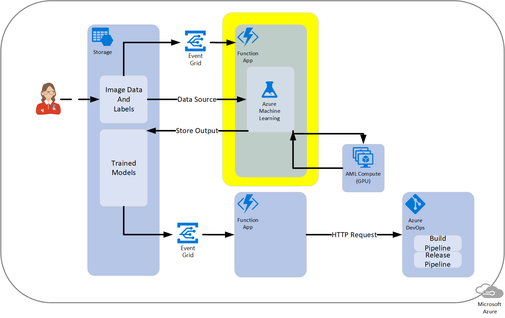
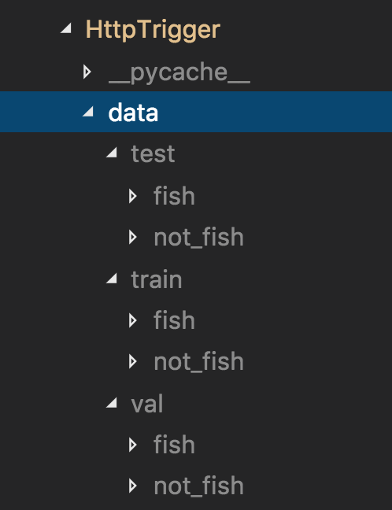

# Training a Model with AzureML and Azure Functions

Automating the training of new ML model given code updates and/or new data with labels provided by a data scientist, can pose a challenge in the context of the dev ops or app development process due to the manual nature of data science work.  One solution would be to use a training script (written by the data scientist) with the <a href="https://docs.microsoft.com/en-us/python/api/overview/azure/ml/intro?view=azure-ml-py" target="_blank">Azure Machine Learning SDK for Python</a> (Azure ML Python SDK) run with a lightweight Azure Function that sends a training script to larger compute (process managed by the dev ops professional) to train an ML model (automatically performed when new data appears).  This, then, triggers the build and release of an intelligent application (managed by the app developer).

The intent of this repository is to communicate the process of training a model using a Python-based Azure Function and the Azure ML Python SDK, as well as, to provide a code sample for doing so.  Training a model with the Azure ML Python SDK involves utilizing an Azure Compute option (e.g. an N-Series AML Compute) - the model **_is not_** trained within the Azure Function Consumption Plan.  Triggers for the Azure Function could be HTTP Requests, an Event Grid or some other <a href="https://docs.microsoft.com/en-us/azure/azure-functions/functions-triggers-bindings"  target="_blank">trigger</a>.

The motivation behind this process was to provide a way to automate ML model training/retraining in a lightweight, serverless fashion, once new data is provided _and potentially_ labels which are stored Azure Storage Blob containers.  This solution is especially attractive for people familiar with <a href="https://docs.microsoft.com/en-us/azure/azure-functions/functions-overview" target="_blank">Azure Functions</a>.

The idea is that once new data is provided, it would signal training a new model via an Event Grid - note that the _training is actually done on a separate compute_, not in the Function.  The Azure ML SDK can be set up to output a model to a user-specified Storage option, here shown as the "Trained Models" Blob Storage Container.  Another lightweight Function, triggered by Event Grid, may be used to send an HTTP request to an Azure DevOps build Pipeline to create the final application.

The following diagram represents an example process as part of a larger deployment.  The end product or application could be an IoT Edge module, web service or any other application a DevOps build/release can produce.



# Getting started

The instructions below are an example - it follows [this Azure Docs tutorial](https://docs.microsoft.com/en-us/azure/azure-functions/functions-create-first-function-python) which should be referenced as needed.

The commands are listed here for quick reference (but if errors are encountered, check the docs link above for troubleshooting, as it may have been updated).

## Prerequisites

- Install Python 3.6
- Install [Functions Core Tools](https://docs.microsoft.com/en-us/azure/azure-functions/functions-run-local#v2)
- Install Docker
- Note: If run on Windows you can use Ubuntu WSL to run the scripts

## Steps

In summary, the steps include the following sections.

- [Deploy locally](#deploy-locally)
- [Set up a Service Principal for AzureML](#set-up-a-service-principal-for-azureml)
- [Data setup](#data-setup)
- [Test locally](#test-locally)
- [Deploy function to Azure](#deploy-function-to-azure)

### Deploy locally

#### Set up virtual environment

Important notes:

* It is good practice to create a fresh virtual environment for each function
* Make sure `.env`, which holds the virtual environment, once created, resides in main folder (same place as `requirements.txt`)
* Make sure to use the `pip` installer from the virtual environment

**Create the virtual environment**

The `venv` command is part of the Python standard library as of version 3.3.  Python 3.6 is being used in this sample.

```
python3.6 -m venv .env
```

**Activate the virtual environment**

On Windows, the command is:

```
.env\Scripts\activate

```

On unix systems (including MacOS), the command is:
```
source .env/bin/activate
```

**Install the required Python packages**

Please check the `requirements.txt` file for versions of packages used.  

IMPORTANT NOTE:  If a more recent version of a package is available it is ok to update after testing locally and in a staging environment.

On Windows, the command to install packages is as follows.

```
.env\Scripts\pip install -r requirements.txt
```

On unix systems (including macOS), the command is as follows.

```
.env/bin/pip install -r requirements.txt
```

### Set up a Service Principal for AzureML

This will set up an Azure Active Directory registered application so that we can authenticate in Azure in code, as we will do for the AzureML workspace, without a requirement for interactive or CLI-based login.

Follow the brief instructions under "Service Principal Authentication" in <a href="https://github.com/Azure/MachineLearningNotebooks/blob/master/how-to-use-azureml/manage-azureml-service/authentication-in-azureml/authentication-in-azure-ml.ipynb" target="_blank">this doc</a> for setting up the application that will allow authentication more easily.

Take note of the variables mentioned in the doc for the next section.

#### Set up environment variables 

This is so that AzureML, Service Principal and correct storage accounts may be accessed.

**For local testing**

Unix systems create a shell script `set_vars.sh` to set environment variables in the current shell.  Run this in the bash terminal.

```
export AZURE_SUB=<Azure subscription id>
export RESOURCE_GROUP=<resource group for AzureML>
export WORKSPACE_NAME=<workspace name>
export STORAGE_CONTAINER_NAME_TRAINDATA=<storage blob for training data>
export STORAGE_CONTAINER_NAME_MODELS=<storage blob for trained model(s)>
export STORAGE_ACCOUNT_NAME=<storage account name>
export STORAGE_ACCOUNT_KEY=<storage account key>
export TENANT_ID=<tenant id from AAD>
export APP_ID=<registered application id>
export PRINCIPAL_PASSWORD=<service principal password>
```

On Windows create a script called `set_vars.cmd` and run it in the shell where the work is being done.

```
set AZURE_SUB <Azure subscription id>
set RESOURCE_GROUP <resource group for AzureML>
set WORKSPACE_NAME <workspace name>
set STORAGE_CONTAINER_NAME_TRAINDATA <storage blob for training data>
set STORAGE_CONTAINER_NAME_MODELS <storage blob for trained model(s)>
set STORAGE_ACCOUNT_NAME <storage account name>
set STORAGE_ACCOUNT_KEY <storage account key>
set TENANT_ID <tenant id from AAD>
set APP_ID <registered application id>
set PRINCIPAL_PASSWORD <service principal password>
```

Run each file in a bash shell/terminal window.

Further descriptions of the environment variables are as follows.

1. `AZURE_SUB` - the Azure Subscription id
2. `RESOURCE_GROUP` - the resource group in which AzureML Workspace is found
3. `WORKSPACE_NAME` - the AzureML Workspace name (create this if it doesn't exist - [with code](https://docs.microsoft.com/en-us/azure/machine-learning/service/quickstart-create-workspace-with-python) or [in Azure Portal](https://docs.microsoft.com/en-us/azure/machine-learning/service/quickstart-get-started))
4. `STORAGE_CONTAINER_NAME_TRAINDATA` - the Blob Storage container name containing the training data (in this sample is was fish images - see [Data setup](#data-setup) above.
5. `STORAGE_CONTAINER_NAME_MODELS` - the specific Blob Storage container where the output model should go (this could be the same as the `STORAGE_CONTAINER_NAME_TRAINDATA`)
5. `STORAGE_ACCOUNT_NAME` - the Storage Account name for the training and model blobs
6. `STORAGE_ACCOUNT_KEY` - the Storage Account access key for the training and model blobs (Note:  these must be in the same Storage Account)
7.  `TENANT_ID` - from AAD the tenant ID for subscription from Service Principal step
8.  `APP_ID` - the AAD registered application ID from Service Principal step
9.  `PRINCIPAL_PASSWORD` - the AAD registered app password from Service Principal step

**Note:  For when moving on to Azure deployments**

 Add as a key/value pairs, when performing deployment to Azure, the following under **Application settings** in the "Application settings" configuration link/tab in the Azure Portal under the published Azure Function App.

### Data setup

In this example the labels are `fish`/`not_fish` for a binary classification scenario in this example which uses the PyTorch framework.  The data structure in this repo is shown in the following image.  For adding training data, use this structure so that the Python scripts may find the data.

A `train` and `val` folder are both required for training.  The folders under `train` and `val` are used in PyTorch's `datasets.ImageFolderImage()` function that delineates the labels using folder names, a common pattern for classification.

Notice that the `data` folder is under the Function's `HttpTrigger` folder.




### Test locally

**Start the function**

From the base of the repo run the following.

```   
func host start
```

Information similar to the following should appear.


This provides a URL with which to use as a POST HTTP call.

**Call the function**

For now this can be a POST request using `https://<base url>/api/HttpTrigger?start=<any string>`, where `start` is specified as the parameter in the Azure Function `__init__.py` code and the value is any string for this sample (note:  this is a potential entrypoint for passing a variable to the Azure Function in the future).


One way to call the Function App is with the `curl` command.

```
curl http://localhost:7071/api/HttpTrigger?start=foo
```


### Deploy function to Azure

Use the following commands to deploy the function to Azure from a local machine that _has this repo cloned locally_.

Here is an example of deploying this sample to `westus` region.  Update the `--location`, `--name`'s, `resource-group`, and `--sku` as needed.

Use the Azure CLI to log in.

```
az login
```

Create a resource group for the Azure Function.

```
az group create --name azfunc --location westus
```

Create a storage account for the Azure Function.

```
az storage account create --name azfuncstorage123 --location westus --resource-group azfunc --sku Standard_LRS

```

Create the Azure Function.

```
az functionapp create --resource-group azfunc --os-type Linux --consumption-plan-location westus --runtime python --name dnnfuncapp --storage-account azfuncstorage123

```

Publish the Azure Function.

```
func azure functionapp publish dnnfuncapp --build-native-deps
```

IMPORTANT NOTE:  Don't forget to add as a key/value pairs, when performing deployment to Azure, the environment variables (from above) under **Application settings** in the "Application settings" configuration link/tab in the Azure Portal under the published Azure Function App.

#### Test deployment

For now this can be a POST request using `https://<base url>/api/HttpTrigger?start=<any string>`, where `start` is specified as the parameter in the Azure Function `__init__.py` code and the value is any string (this is a potential entrypoint for passing a variable to the Azure Function in the future).

One way to call the Function App, for e.g., is:

```
curl https://dnnfuncapp.azurewebsites.net/api/HttpTrigger?start=foo
```

Or to go to the browser and enter in the same URL.

This may time out, but don't worry if this happens.  For proof of successful execution check for a completed AzureML Experiment run in the Azure Portal ML Workspace and look for the model in the blob storage as well (specified earlier in STORAGE_CONTAINER_NAME_MODELS).

## References

1. <a target="_blank" href="https://docs.microsoft.com/en-us/rest/api/azure/devops/build/Builds/Queue?view=azure-devops-rest-5.1">Queue an Azure DevOps Build with HTTP request</a>
2. <a href="https://docs.microsoft.com/en-us/azure/machine-learning/service/overview-what-is-azure-ml" target="_blank">Azure Machine Learning Services Overview</a>
3. <a href="https://docs.microsoft.com/en-us/azure/machine-learning/service/how-to-access-data" target="_blank">Using a Azure Storage with Azure ML Python SDK</a>
4. <a href="https://docs.microsoft.com/en-us/azure/azure-functions/functions-create-first-function-python" target="_blank">Python Azure Functions</a>
5. [How to call another function with in an Azure function (StackOverflow)](https://stackoverflow.com/questions/46315734/how-to-call-another-function-with-in-an-azure-function)
6.  [Creation of virtual environments](https://docs.python.org/3/library/venv.html)
7.  [How to access data in Blob and elsewhere with the AzureML Python SDK](https://docs.microsoft.com/en-us/azure/machine-learning/service/how-to-access-data)

## Troubleshooting

* Function using the wrong Python:  if there are multiple versions of Python on the system, be sure to preface any `func` commands with `PYTHONPATH=.env/bin/python` to ensure the correct Python interpreter is being used.

